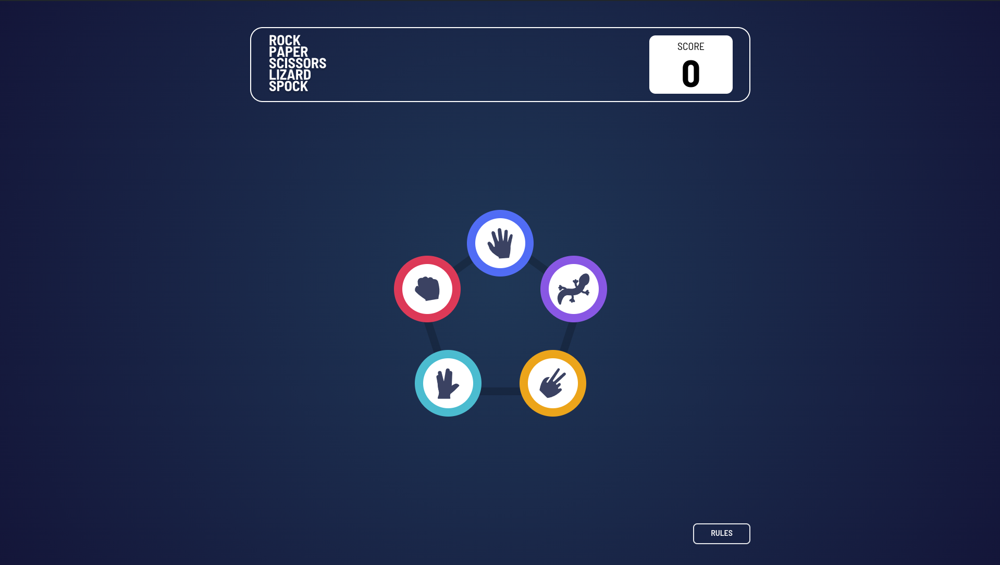
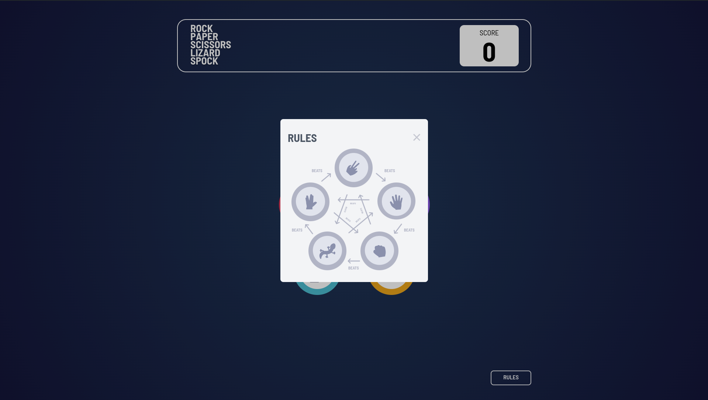
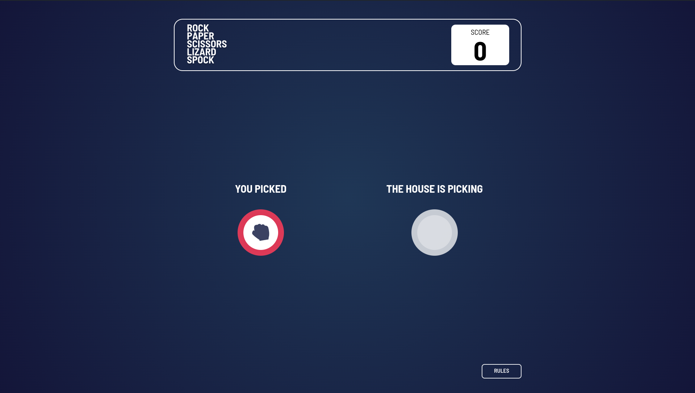
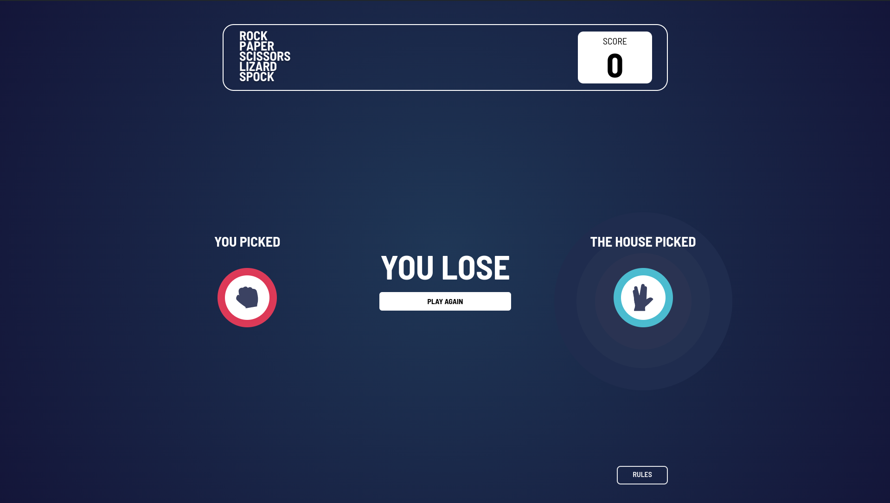
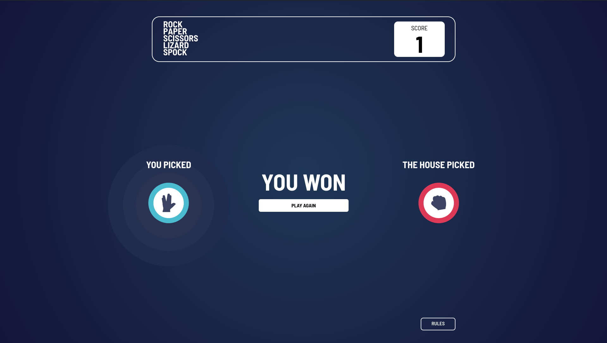

# Rock, Paper, Scissors - Frontend Mentor

This is a solution to the [Rock, Paper, Scissors challenge on Frontend Mentor](https://www.frontendmentor.io/challenges/rock-paper-scissors-game-pTgwgvgH). Frontend Mentor challenges help you improve your coding skills by building realistic projects. 

## Table of contents

- [Rock, Paper, Scissors - Frontend Mentor](#rock-paper-scissors---frontend-mentor)
  - [Table of contents](#table-of-contents)
  - [Overview](#overview)
    - [The challenge](#the-challenge)
    - [Screenshot](#screenshot)
    - [Links](#links)
  - [My process](#my-process)
    - [Built with](#built-with)
  - [Author](#author)

## Overview

### The challenge

Users should be able to:
- Play Rock, Paper, Scissors against the computer
- Maintain the state of the score after refreshing the browser _(optional)_

### Screenshot

### Links

- Solution URL: [Github]()
- Live Site URL: [Live]()

## My process

### Built with

- Semantic HTML5 markup
- CSS custom properties
- Flexbox
- CSS Grid
- Mobile-first workflow
- [Vue](https://vuejs.org/) - JS Framework
- [Vue Router](https://router.vuejs.org/) - Router
- [Pinia](https://pinia.vuejs.org/) - Global Store
- [TailwindCSS](https://tailwindcss.com/) - CSS Framework

## Author

- Website - [Carlos Rubio](https://carlosrubio.vercel.app/)
- Frontend Mentor - [@Reyniery-Carlitos](https://www.frontendmentor.io/profile/Reyniery-Carlitos)